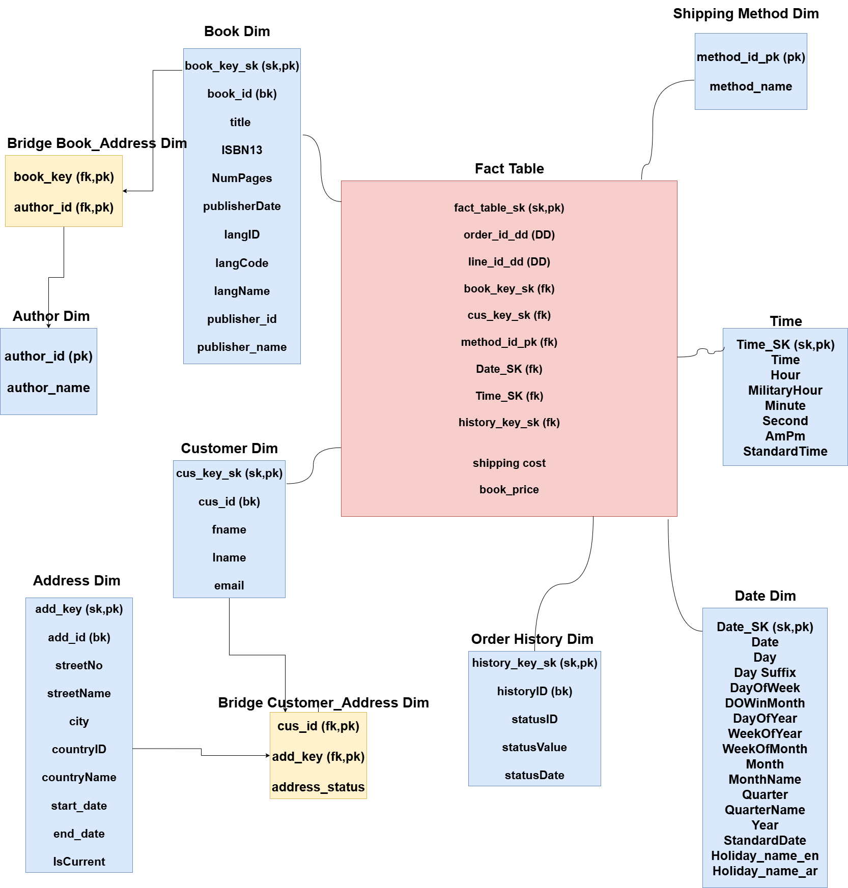
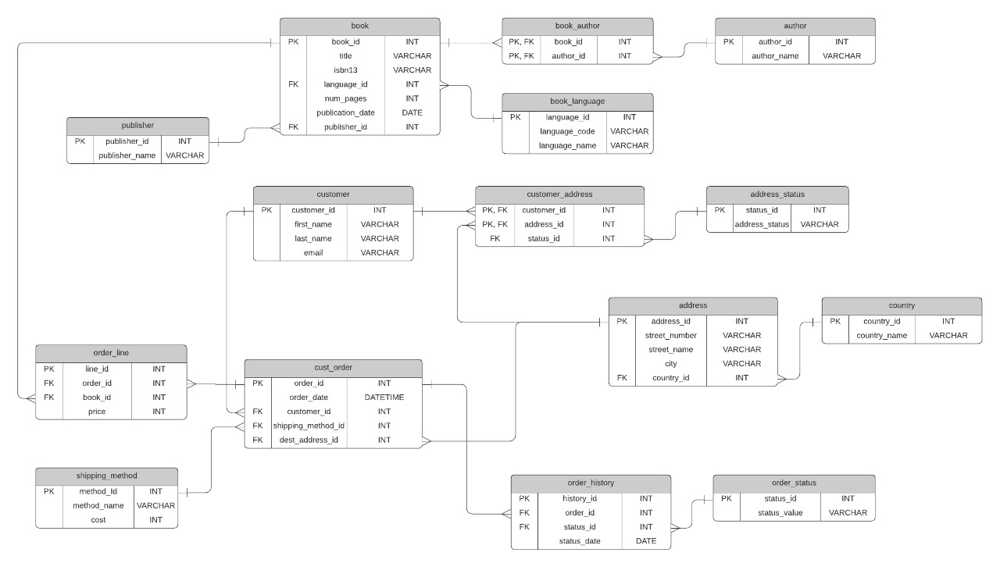

# Gravity Book Store - Data Warehouse Project

A comprehensive **Business Intelligence solution** for a book store, implementing a complete data warehouse using Microsoft's BI stack.

---

## 📊 Project Overview

This project demonstrates a full end-to-end data warehouse implementation for an online book store business, including dimensional modeling, ETL processes, and analytical reporting.

**Domain**: E-commerce (Book Retail)  
**Purpose**: Enable data-driven decision making through sales, customer, and inventory analytics

---

## 🏗️ Architecture

### Data Warehouse Model


### Source Database Schema


**Schema Design**: Star Schema with 1 Fact Table, 10 Dimension Tables, and 2 Bridge Tables

---

## 🛠️ Technology Stack

| Component | Technology |
|-----------|-----------|
| **Database** | SQL Server |
| **ETL** | SSIS (SQL Server Integration Services) |
| **OLAP** | SSAS (SQL Server Analysis Services) |
| **Reporting** | Power BI |

---

## 📁 Project Structure

```
├── README.md                          # Project documentation
├── database/
│   └── GBS_Schema.sql                # Complete database schema
├── docs/
│   ├── GBS_DWH_Model.png             # Data warehouse model
│   ├── GBS_Database.jpg              # Source database diagram
│   └── DW_Project.docx               # Detailed documentation
├── reports/
│   └── DWH_Analysis.pbix             # Power BI analysis
└── etl/ssis/                         # 9 SSIS ETL packages
    ├── P1_Dim_Author.dtsx
    ├── P2_Dim_Shipping_Method.dtsx
    ├── P3_Dim_Order_History.dtsx
    ├── P4_Dim_Book.dtsx
    ├── P5_Dim_Bridge_Book_Author.dtsx
    ├── P6_Dim_Address.dtsx
    ├── P7_Dim_Customer.dtsx
    ├── P8_Dim_Bridge_Customer_Address.dtsx
    └── P9_Fact_Table.dtsx
```

---

## 📐 Database Schema

### Fact Table
- **fact_table_gravity_book_store**: Order transactions with book prices and shipping costs

### Dimension Tables
1. **dim_book** - Book catalog (title, ISBN, publisher, language)
2. **dim_author** - Author information
3. **dim_customer** - Customer master data
4. **dim_address** - Address with historical tracking (Type 2 SCD)
5. **dim_shipping_method** - Shipping methods
6. **dim_order_history** - Order status tracking
7. **Dim_Date** - Date dimension (2020-2030) with US & Egyptian holidays
8. **Dim_Time** - Time dimension (second-level granularity)
9. **dim_bridge_book_author** - Book-Author relationships
10. **dim_bridge_customer_address** - Customer-Address relationships

---

## 🔄 ETL Process

The ETL process consists of 9 SSIS packages executed sequentially:
1. Load dimension tables (P1-P7)
2. Load bridge tables (P5, P8)
3. Load fact table (P9)

---

## 🎯 Key Features

- ✅ Star Schema design optimized for analytics
- ✅ Slowly Changing Dimensions (Type 1 & Type 2)
- ✅ Comprehensive date dimension with bilingual holidays
- ✅ Complete ETL pipeline with SSIS
- ✅ OLAP cube for multidimensional analysis
- ✅ Power BI dashboards

---

## 🚀 Getting Started

### Prerequisites
- SQL Server 2019+
- SQL Server Integration Services (SSIS)
- Power BI Desktop
- Visual Studio with SQL Server Data Tools

### Installation
1. Create database: `CREATE DATABASE GBS;`
2. Execute schema: `sqlcmd -S server -d GBS -i database/GBS_Schema.sql`
3. Configure SSIS connection managers
4. Run ETL packages (P1 through P9)
5. Open Power BI report and refresh data

---

## 📚 Documentation

- **Detailed Documentation**: [docs/DW_Project.docx](docs/DW_Project.docx)
- **Power BI Report**: [reports/DWH_Analysis.pbix](reports/DWH_Analysis.pbix)
- **SQL Schema**: [database/GBS_Schema.sql](database/GBS_Schema.sql)

---

**Project Type**: Data Warehouse & Business Intelligence  
**Schema**: Star Schema with Type 1 & Type 2 SCDs
